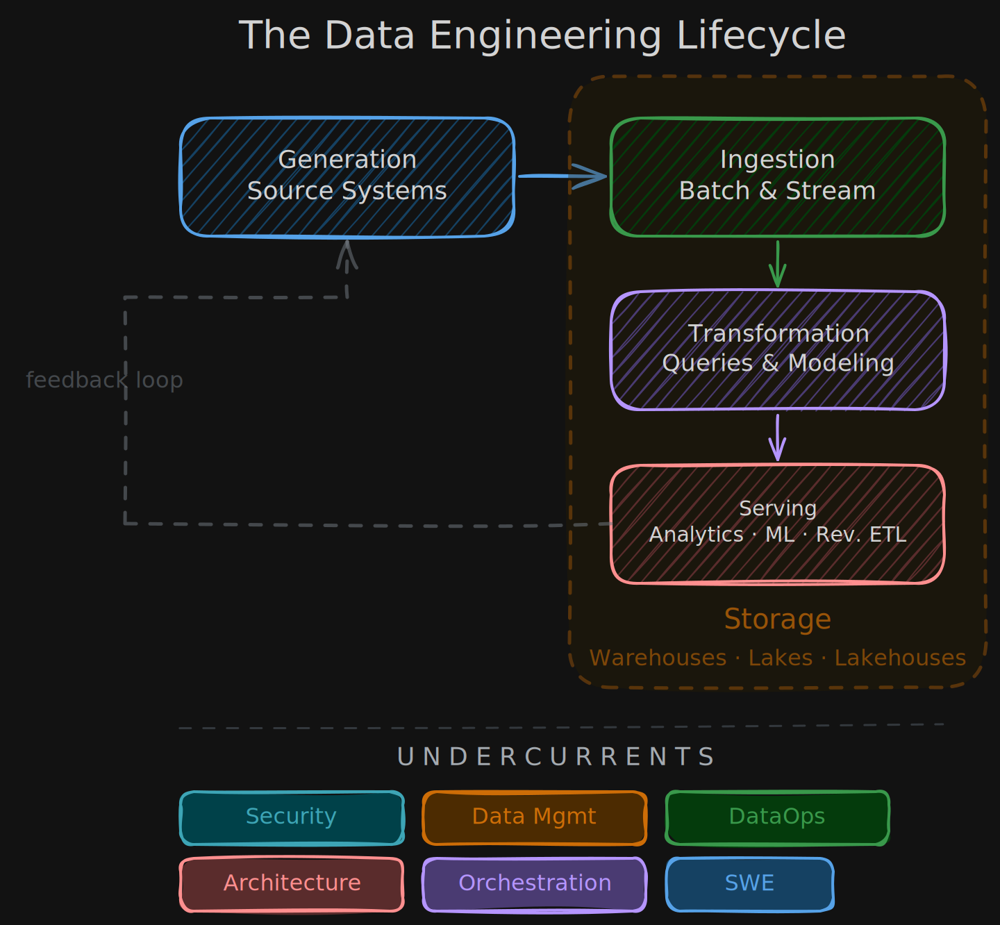
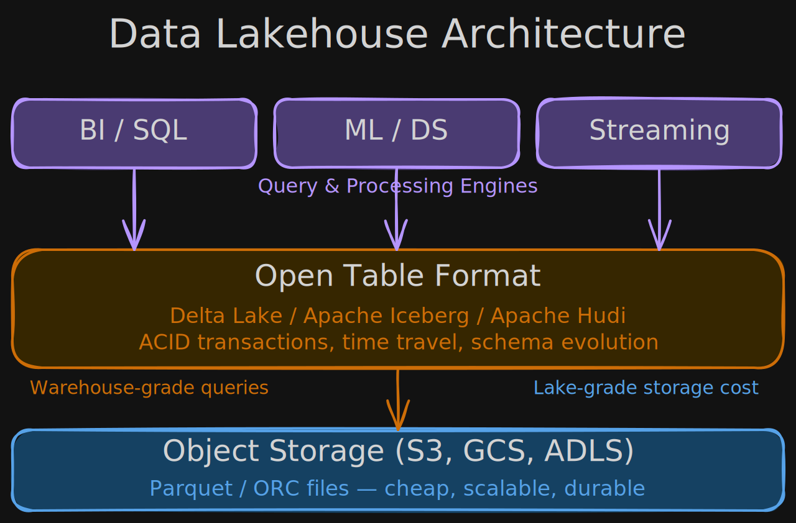
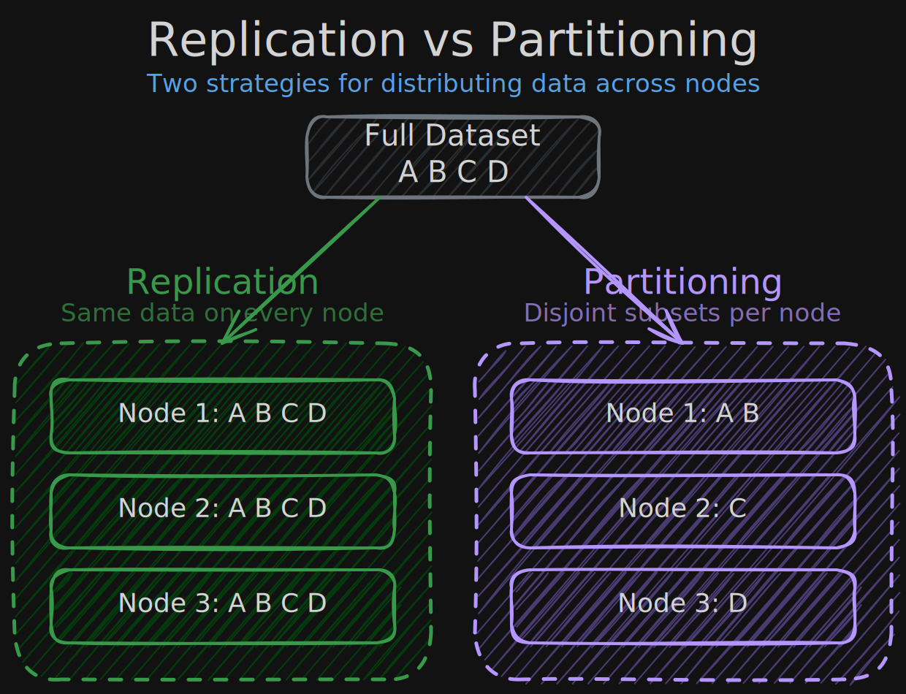

# excalidraw-diagrams-skill

A [Claude Code](https://claude.ai/claude-code) skill for programmatically generating hand-drawn Excalidraw diagrams and embedding them in static sites.

## Example output

### Data Engineering Lifecycle



### Data Lakehouse Architecture



### Replication vs Partitioning



## What it does

Teaches Claude how to:

- Generate `.excalidraw` JSON files with correctly positioned elements
- Export to SVG via headless browser (pixel-perfect Excalidraw rendering)
- Embed diagrams with automatic light/dark theme switching
- Avoid common layout pitfalls (text overflow, arrow alignment, overlapping elements)

## Install

Copy the skill folder into your Claude Code skills directory:

```bash
# Global (all projects)
cp -r . ~/.claude/skills/excalidraw-diagrams

# Or project-specific
cp -r . .claude/skills/excalidraw-diagrams
```

The skill is structured as a folder, not a single file — copy the whole thing so Claude can discover the reference files it needs.

## Prerequisites

The skill instructs Claude to use these tools (installed automatically when needed):

```bash
npm install -g excalidraw-brute-export-cli
npx playwright install
```

## Skill structure

Structured following the [progressive disclosure pattern](https://x.com/trq212/status/2033949937936085378) recommended by Anthropic's Claude Code team — Claude reads the compact main file on trigger and drills into reference files only when it needs specific formulas or property details.

```
excalidraw-diagrams/
  SKILL.md                       → Pipeline + 25-rule summary table (compact, always loaded)
  gotchas.md                     → Pre-export checklist: symptoms → fixes
  references/
    generator.py                 → Runnable Python template with rect/txt/arr helpers
    layout-rules.md              → All 25 layout rules with detailed formulas
    json-reference.md            → Element types, properties, color palette
```

| File | When Claude reads it |
|---|---|
| `SKILL.md` | Every invocation — has the pipeline steps and rule summary |
| `gotchas.md` | Before exporting — catches rendering bugs early |
| `references/layout-rules.md` | When calculating positions, sizing, or arrow routing |
| `references/json-reference.md` | When it needs exact property names or valid values |
| `references/generator.py` | Copied as starting point for each new diagram script |

## What's in the skill

- **Full pipeline**: Generate JSON → Export SVG → Embed with theme switching
- **25 layout rules** that prevent the most common iteration cycles:
  - Positioning: calculate from constants, dynamic row heights, canvas-relative widths
  - Text: centering formula, height from line count, Virgil font width compensation
  - Arrows: binding to box edges, perpendicular final segments, 50px minimum gaps
  - Visual hierarchy: title/subtitle dual-text pattern, minimum font sizes, stroke-colored subtitles
  - Layout selection: vertical flows for sequences, columns for comparisons, grids for equal-weight
- **Gotchas checklist**: 14 symptoms with fixes — things that look right in code but render wrong
- **Runnable generator template**: Python script with helper functions and color palette tuples
- **Excalidraw JSON reference**: Element types, property values, color palette

## Example

Ask Claude:

> "Create an Excalidraw diagram showing the data flow from API to database to dashboard"

With this skill installed, Claude will generate a properly laid out `.excalidraw` file, export both light and dark SVGs, and embed them — without the usual back-and-forth iterations on text alignment, arrow directions, and sizing.

## How it was made

This skill was created using the [Superpowers](https://github.com/superpowers-ai/superpowers) plugin for [Claude Code](https://claude.ai/claude-code), specifically the `superpowers:writing-skills` skill which provides a structured methodology for authoring agent skills.

**The process:**

1. **Real-world iteration** — While building a data engineering course notes website, I needed hand-drawn Excalidraw diagrams embedded directly in the pages. Over ~15 iterations with Claude, we discovered every layout gotcha the hard way: text overflowing boxes, arrows ending mid-block, proportional scaling doing nothing, arrowheads pointing the wrong direction, etc.

2. **Skill extraction** — Once the diagram was working, I used `superpowers:writing-skills` to distill the conversation into a reusable skill. The methodology guided structuring the content with clear triggering conditions, layout rules, a common mistakes table, and a ready-to-use generator template.

3. **Restructuring for progressive disclosure** — Inspired by Thariq's [Lessons from Building Claude Code: How We Use Skills](https://x.com/trq212/status/2033949937936085378), the skill was restructured from a single 650-line file into a folder with reference files. Key takeaways applied: skills are folders not just markdown files, use progressive disclosure so the agent reads detail on demand, extract scripts as actual runnable files, sharpen the description field for model triggering, and promote the gotchas checklist to a top-level file.

4. **Key tools in the pipeline:**
   - **`excalidraw-brute-export-cli`** — Uses Playwright to drive excalidraw.com headlessly, producing pixel-perfect SVG/PNG exports with real Excalidraw fonts (Virgil)
   - **Python** — For systematically calculating element positions and generating `.excalidraw` JSON
   - **Playwright** — Browser automation engine used under the hood for export

The goal: capture all the hard-won lessons so future diagrams work on the first try, without the trial-and-error.

## License

MIT
